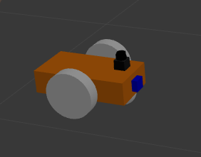

# Go-chaise-it

This is the second project of the Udacity's Nanodegree: robotic software engineer.
In this project, we are asked to build a robot that can chaise a ball using camera and Lidar sensor using ROS, to visualize it in a Gazebo simulation and to visualize sensors data in RViz simulator.
F mourain functionalities of ROS are explored:

- creating ROS nodes
- communicating using topics and services
- integrating Gazebo object and world
- integrating RViz simulator

## Robot model ##
The built robot contains:

- chassis
- two wheels
- camera 
- Lidar sensor



## Building and running ##
Run the following commands to run the robot inside its world:
```
git clone https://github.com/mounalbaccouch/Go-chaise-it
cd Go-chaise-it/catkin_ws
catkin_make
source devel/setup.bash
roslaunch my_robot world.launch
```
In another terminal, run the following command to run "drive_bot" and "process_image" nodes:
```
source devel/setup.bash
roslaunch ball_chaser ball_chaser.launch
```
In another terminal, run the following command to visualize the robot’s camera images:
```
source devel/setup.bash
rosrun rqt_image_view rqt_image_view 
```
