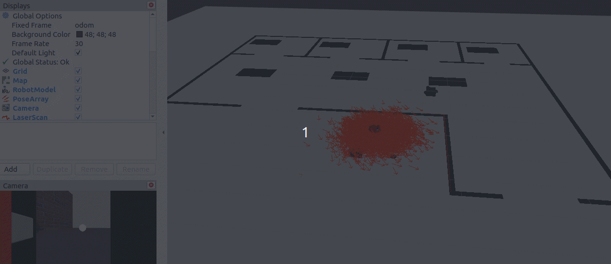

# Where-am-I

This is the third project of the Udacity's Nanodegree: robotic software engineer.
In this project, we are asked to localize the robot using AMCL node inside a generated map.

Adaptive Monte Carlo Localization (AMCL) dynamically adjusts the number of particles over a period of time, as the robot navigates around in a map. This adaptive process offers a significant computational advantage over MCL.
This project is a clone of the previous project Go-chase-it where we were asked to build a robot that can chaise a ball using camera and Lidar sensor.

To do this, the main steps are:

- creating the amcl launch file and integrate the nodes: amcl, move_base and map_server
- generate a map of the environnement using pgm_map_creator package
- adding the teleop_twist_keyboard to test the localization

## Building and running ##
- Run the following commands to run the robot inside its world:
```
git clone https://github.com/mounalbaccouch/Robotic-ND/
cd Robotic-ND/Where-am-I/catkin_ws/
catkin_make
source devel/setup.bash
roslaunch my_robot world.launch
```
- Use the saved RViz config config.rviz
- In another terminal, run the following command to run the "amcl" node:
```
source devel/setup.bash
roslaunch my_robot amcl.launch
```
- In another terminal, run the teleop package to see the robot localizing itself while moving:
```
source devel/setup.bash
rosrun teleop_twist_keyboard teleop_twist_keyboard.py
```
## Test case ##
To do the test, I used the package ball_chaser. In another terminal, launch this command to launch the ball_chaser node:
```
source devel/setup.bash
roslaunch ball_chaser ball_chaser.launch
```
This is a screenshot of the test:

<p align="center">

</p>
